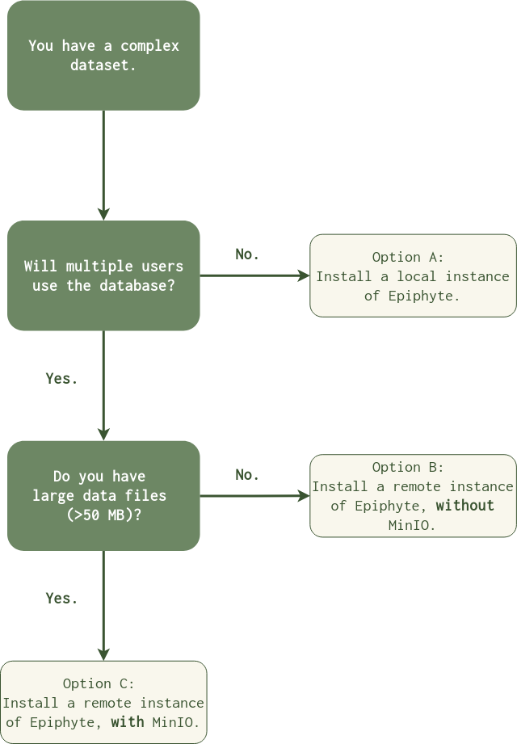

## Installation

Epiphyte is a Python package with optional MySQL and MinIO backends.

- Install package: `pip install epiphyte` (or from source in this repo)
- See Tutorials for database and object storage setup
- Configure connection details in `src/epiphyte/database/access_info.py`

