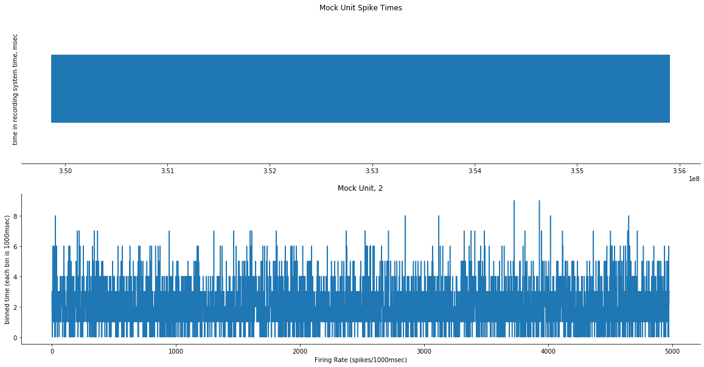
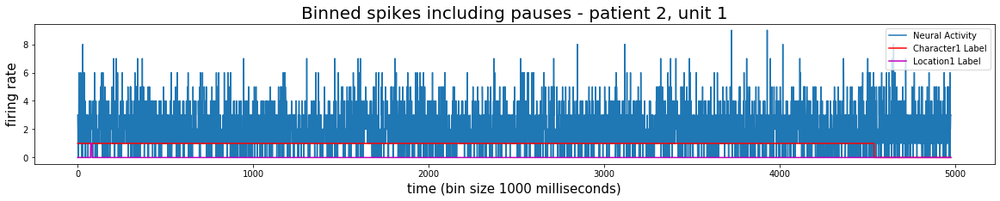

# Example analysis pipeline

## Simple comparison of neural activity during stimulus condition on/off 


Load in relevant local application modules:


```python
import sys
import matplotlib.pyplot as plt

import os
import sys
import numpy as np
import random
from random import uniform
import copy

from types import SimpleNamespace
import inflect

# Local application imports 
from database.db_setup import *
import preprocessing.data_preprocessing.binning as binning
import preprocessing.data_preprocessing.create_vectors_from_time_points as create
import annotation.stimulus_driven_annotation.movies.annotation_utils as utils
```

    Please enter DataJoint username:  root
    Please enter DataJoint password:  ···············


    Connecting root@localhost:3306


```python
erd = dj.ERD(epi_schema)
erd
```


    

    


Set parameters:


```python
patient_id = 2
session_nr = 1
unit_nr = 1
bin_size = 1000
```

Get activity from the database, set binning parameters, and bin: 


```python
spike_times = get_spiking_activity(patient_id, session_nr, unit_nr)
spike_times = spike_times / 1000 # convert to milliseconds

exclude_pauses = False
output_edges = True

binned_spikes, edges = binning.bin_spikes(patient_id, session_nr, spike_times, bin_size, exclude_pauses, output_edges) 
```


```python
fig, (ax1, ax2) = plt.subplots(2, 1, figsize=(20,10))

ax1.eventplot(spike_times)
ax1.set_title("Mock Unit Spike Times")
ax1.spines['top'].set_visible(False)
ax1.spines['left'].set_visible(False)
ax1.spines['right'].set_visible(False)
ax1.set_yticks([])
ax1.set_ylabel("time in recording system time, msec")

ax2.plot(binned_spikes)
ax2.set_title("Mock Unit, 2")
ax2.spines['top'].set_visible(False)
ax2.spines['right'].set_visible(False)
#ax2.set_yticks([])
ax2.set_xlabel("Firing Rate (spikes/1000msec)")
ax2.set_ylabel("binned time (each bin is 1000msec)")
```


    Text(0, 0.5, 'binned time (each bin is 1000msec)')


    

    


## Using edges outputted above, generate a vector representing when a feature was presented during the stimulus:  


```python
PatientAlignedMovieAnnotation()
```


        <style type="text/css">
            .Relation{
                border-collapse:collapse;
            }
            .Relation th{
                background: #A0A0A0; color: #ffffff; padding:4px; border:#f0e0e0 1px solid;
                font-weight: normal; font-family: monospace; font-size: 100%;
            }
            .Relation td{
                padding:4px; border:#f0e0e0 1px solid; font-size:100%;
            }
            .Relation tr:nth-child(odd){
                background: #ffffff;
            }
            .Relation tr:nth-child(even){
                background: #f3f1ff;
            }
            /* Tooltip container */
            .djtooltip {
            }
            /* Tooltip text */
            .djtooltip .djtooltiptext {
                visibility: hidden;
                width: 120px;
                background-color: black;
                color: #fff;
                text-align: center;
                padding: 5px 0;
                border-radius: 6px;
                /* Position the tooltip text - see examples below! */
                position: absolute;
                z-index: 1;
            }
            #primary {
                font-weight: bold;
                color: black;
            }

            #nonprimary {
                font-weight: normal;
                color: white;
            }

            /* Show the tooltip text when you mouse over the tooltip container */
            .djtooltip:hover .djtooltiptext {
                visibility: visible;
            }
        </style>

        <b>Movie Annotations aligned to patient time / time points are in neural recording time</b>
            <div style="max-height:1000px;max-width:1500px;overflow:auto;">
            <table border="1" class="Relation">
                <thead> <tr style="text-align: right;"> <th> <div class="djtooltip">
                                <p id="primary">annotator_id</p>
                                <span class="djtooltiptext">unique ID for each annotator</span>
                            </div></th><th><div class="djtooltip">
                                <p id="primary">label_name</p>
                                <span class="djtooltiptext">label name</span>
                            </div></th><th><div class="djtooltip">
                                <p id="primary">annotation_date</p>
                                <span class="djtooltiptext">date of annotation</span>
                            </div></th><th><div class="djtooltip">
                                <p id="primary">session_nr</p>
                                <span class="djtooltiptext">session ID</span>
                            </div></th><th><div class="djtooltip">
                                <p id="primary">patient_id</p>
                                <span class="djtooltiptext">patient ID</span>
                            </div></th><th><div class="djtooltip">
                                <p id="nonprimary">label_in_patient_time</p>
                                <span class="djtooltiptext">label matched to patient time (pts)</span>
                            </div></th><th><div class="djtooltip">
                                <p id="nonprimary">values</p>
                                <span class="djtooltiptext">list of values that represent label</span>
                            </div></th><th><div class="djtooltip">
                                <p id="nonprimary">start_times</p>
                                <span class="djtooltiptext">list of start times of label segments in neural recording time</span>
                            </div></th><th><div class="djtooltip">
                                <p id="nonprimary">stop_times</p>
                                <span class="djtooltiptext">list of stop times of label segments in neural recording time</span>
                            </div></th><th><div class="djtooltip">
                                <p id="nonprimary">additionl_information</p>
                                <span class="djtooltiptext"></span>
                            </div> </th> </tr> </thead>
                <tbody> <tr> <td>p2</td>
<td>character1</td>
<td>2019-12-12</td>
<td>1</td>
<td>1</td>
<td>=BLOB=</td>
<td>=BLOB=</td>
<td>=BLOB=</td>
<td>=BLOB=</td>
<td></td></tr><tr><td>p2</td>
<td>character1</td>
<td>2019-12-12</td>
<td>1</td>
<td>2</td>
<td>=BLOB=</td>
<td>=BLOB=</td>
<td>=BLOB=</td>
<td>=BLOB=</td>
<td></td></tr><tr><td>p2</td>
<td>character1</td>
<td>2019-12-12</td>
<td>1</td>
<td>3</td>
<td>=BLOB=</td>
<td>=BLOB=</td>
<td>=BLOB=</td>
<td>=BLOB=</td>
<td></td></tr><tr><td>p2</td>
<td>character2</td>
<td>2019-10-10</td>
<td>1</td>
<td>1</td>
<td>=BLOB=</td>
<td>=BLOB=</td>
<td>=BLOB=</td>
<td>=BLOB=</td>
<td></td></tr><tr><td>p2</td>
<td>character2</td>
<td>2019-10-10</td>
<td>1</td>
<td>2</td>
<td>=BLOB=</td>
<td>=BLOB=</td>
<td>=BLOB=</td>
<td>=BLOB=</td>
<td></td></tr><tr><td>p2</td>
<td>character2</td>
<td>2019-10-10</td>
<td>1</td>
<td>3</td>
<td>=BLOB=</td>
<td>=BLOB=</td>
<td>=BLOB=</td>
<td>=BLOB=</td>
<td></td></tr><tr><td>p2</td>
<td>location1</td>
<td>2020-01-01</td>
<td>1</td>
<td>1</td>
<td>=BLOB=</td>
<td>=BLOB=</td>
<td>=BLOB=</td>
<td>=BLOB=</td>
<td></td></tr><tr><td>p2</td>
<td>location1</td>
<td>2020-01-01</td>
<td>1</td>
<td>2</td>
<td>=BLOB=</td>
<td>=BLOB=</td>
<td>=BLOB=</td>
<td>=BLOB=</td>
<td></td></tr><tr><td>p2</td>
<td>location1</td>
<td>2020-01-01</td>
<td>1</td>
<td>3</td>
<td>=BLOB=</td>
<td>=BLOB=</td>
<td>=BLOB=</td>
<td>=BLOB=</td>
<td></td> </tr> </tbody>
            </table>

            <p>Total: 9</p></div>


```python
label_name = "location1"
annotator_id = "p2"
annotation_date = "2020-01-01"

values_local, starts_local, stops_local = get_patient_aligned_annotations(patient_id, label_name, annotator_id, annotation_date)
```


```python
label_name = "character1"
annotator_id = "p2"
annotation_date = "2019-12-12"

values_char1, starts_char1, stops_char1 = get_patient_aligned_annotations(patient_id, label_name, annotator_id, annotation_date)
```


```python
character1_binned = create.create_vector_from_start_stop_times_reference(edges, values_char1, starts_char1, stops_char1)
location1_binned = create.create_vector_from_start_stop_times_reference(edges, values_local, starts_local, stops_local)
```


```python
fig = plt.figure(figsize=(20,3))
plt.plot(binned_spikes, label="Neural Activity")
plt.plot(character1_binned, color="r", label="Character1 Label")
plt.plot(location1_binned, color="m", label="Location1 Label")
if exclude_pauses:
    plt.title("Binned spikes excluding pauses - patient {}, unit {}".format(patient_id, unit_nr), fontsize=20)
else:
    plt.title("Binned spikes including pauses - patient {}, unit {}".format(patient_id, unit_nr), fontsize=20)
plt.xlabel("time (bin size {} milliseconds)".format(bin_size), fontsize=15)
plt.ylabel("firing rate", fontsize=15)

plt.legend()

plt.show()
```


    

    


Split activity into groups corresponding to the stimulus values, 

* One: Stimulus-on condition 
* Zero: Stimulus-off condition


```python
char1_splits = utils.split_activity_by_value(binned_spikes, character1_binned)
char1_activity = SimpleNamespace(**char1_splits)
char1_on = char1_activity.one
char1_off = char1_activity.zero

loc1_splits = utils.split_activity_by_value(binned_spikes, location1_binned)
loc1_activity = SimpleNamespace(**loc1_splits)
loc1_on = loc1_activity.one
loc1_off = loc1_activity.zero
```


```python
print("Firing rates during character 1 on-screen: ", char1_on)
print("Firing rates during character 1 off-screen: ", char1_on)

assert (len(char1_off) + len(char1_on)) == (len(character1_binned))

print("")

print("Firing rates during location 1 on-screen: ", loc1_on)
print("Firing rates during location 1 off-screen: ", loc1_off)

assert (len(loc1_off) + len(loc1_on)) == (len(location1_binned))
```

    Firing rates during character 1 on-screen:  [3 2 0 ... 2 5 1]
    Firing rates during character 1 off-screen:  [3 2 0 ... 2 5 1]
    
    Firing rates during location 1 on-screen:  [1 4 3 2 2 2 2 3]
    Firing rates during location 1 off-screen:  [3 2 0 ... 2 3 3]


```python
def exact_mc_perm_test(xs, ys, nmc):
    n, k = len(xs), 0
    diff = np.abs(np.mean(xs) - np.mean(ys))
    zs = np.concatenate([xs, ys])
    for j in range(nmc):
        np.random.shuffle(zs)
        k += diff < np.abs(np.mean(zs[:n]) - np.mean(zs[n:]))
    return k / nmc
```


```python
print(exact_mc_perm_test(loc1_on, loc1_off, 1000))
print(exact_mc_perm_test(char1_on, char1_off, 1000))
```

    0.539
    0.148

