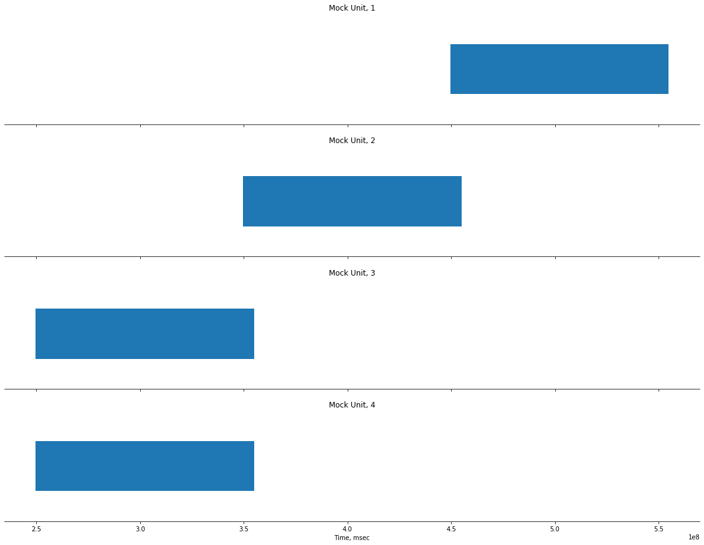
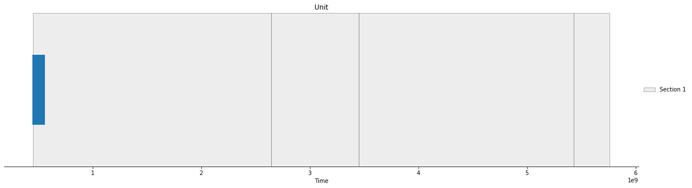

# Example Plots

## Notebook with example interactions with the database for plotting data. 


```python
import numpy as np
import pandas as pd
import matplotlib.pyplot as plt

import random
```


```python
from database.db_setup import *
import database.config as config
```

    Please enter DataJoint username:  root
    Please enter DataJoint password:  ···············


    Connecting root@localhost:3306


```python
erd = dj.ERD(epi_schema)
erd
```


    

    


# Multiple Eventplots

### Check table contents: 


```python
SpikeTimesDuringMovie()
```


        <style type="text/css">
            .Relation{
                border-collapse:collapse;
            }
            .Relation th{
                background: #A0A0A0; color: #ffffff; padding:4px; border:#f0e0e0 1px solid;
                font-weight: normal; font-family: monospace; font-size: 100%;
            }
            .Relation td{
                padding:4px; border:#f0e0e0 1px solid; font-size:100%;
            }
            .Relation tr:nth-child(odd){
                background: #ffffff;
            }
            .Relation tr:nth-child(even){
                background: #f3f1ff;
            }
            /* Tooltip container */
            .djtooltip {
            }
            /* Tooltip text */
            .djtooltip .djtooltiptext {
                visibility: hidden;
                width: 120px;
                background-color: black;
                color: #fff;
                text-align: center;
                padding: 5px 0;
                border-radius: 6px;
                /* Position the tooltip text - see examples below! */
                position: absolute;
                z-index: 1;
            }
            #primary {
                font-weight: bold;
                color: black;
            }

            #nonprimary {
                font-weight: normal;
                color: white;
            }

            /* Show the tooltip text when you mouse over the tooltip container */
            .djtooltip:hover .djtooltiptext {
                visibility: visible;
            }
        </style>

        <b>This table contains all spike times of all units of all patients in Neural Recording Time</b>
            <div style="max-height:1000px;max-width:1500px;overflow:auto;">
            <table border="1" class="Relation">
                <thead> <tr style="text-align: right;"> <th> <div class="djtooltip">
                                <p id="primary">patient_id</p>
                                <span class="djtooltiptext">patient ID</span>
                            </div></th><th><div class="djtooltip">
                                <p id="primary">unit_id</p>
                                <span class="djtooltiptext">unique ID for unit (for respective  patient)</span>
                            </div></th><th><div class="djtooltip">
                                <p id="primary">session_nr</p>
                                <span class="djtooltiptext">session ID</span>
                            </div></th><th><div class="djtooltip">
                                <p id="nonprimary">spike_times</p>
                                <span class="djtooltiptext">in case bin_size is not 0: number of spikes; otherwise: times of spikes (original data)</span>
                            </div> </th> </tr> </thead>
                <tbody> <tr> <td>1</td>
<td>0</td>
<td>1</td>
<td>=BLOB=</td></tr><tr><td>1</td>
<td>1</td>
<td>1</td>
<td>=BLOB=</td></tr><tr><td>1</td>
<td>2</td>
<td>1</td>
<td>=BLOB=</td></tr><tr><td>1</td>
<td>3</td>
<td>1</td>
<td>=BLOB=</td></tr><tr><td>1</td>
<td>4</td>
<td>1</td>
<td>=BLOB=</td></tr><tr><td>1</td>
<td>5</td>
<td>1</td>
<td>=BLOB=</td></tr><tr><td>1</td>
<td>6</td>
<td>1</td>
<td>=BLOB=</td></tr><tr><td>1</td>
<td>7</td>
<td>1</td>
<td>=BLOB=</td></tr><tr><td>1</td>
<td>8</td>
<td>1</td>
<td>=BLOB=</td></tr><tr><td>1</td>
<td>9</td>
<td>1</td>
<td>=BLOB=</td></tr><tr><td>1</td>
<td>10</td>
<td>1</td>
<td>=BLOB=</td></tr><tr><td>1</td>
<td>11</td>
<td>1</td>
<td>=BLOB=</td> </tr> </tbody>
            </table>
            <p>...</p>
            <p>Total: 268</p></div>


### Load in activity from the database:


```python
unit0 = get_spiking_activity(1, 1, 1)
unit1 = get_spiking_activity(2, 1, 1)
unit2 = get_spiking_activity(3, 1, 1)
unit3 = get_spiking_activity(3, 1, 20)
```

### Plot activity 


```python
fig, (ax1, ax2, ax3, ax4) = plt.subplots(4, 1, figsize=(20,15), sharex=True)

ax1.eventplot(unit0)
ax1.set_title("Mock Unit, 1")
ax1.spines['top'].set_visible(False)
ax1.spines['left'].set_visible(False)
ax1.spines['right'].set_visible(False)
ax1.set_yticks([])

ax2.eventplot(unit1)
ax2.set_title("Mock Unit, 2")
ax2.spines['top'].set_visible(False)
ax2.spines['left'].set_visible(False)
ax2.spines['right'].set_visible(False)
ax2.set_yticks([])

ax3.eventplot(unit2)
ax3.set_title("Mock Unit, 3")
ax3.spines['top'].set_visible(False)
ax3.spines['left'].set_visible(False)
ax3.spines['right'].set_visible(False)
ax3.set_yticks([])

ax4.eventplot(unit3)
ax4.set_title("Mock Unit, 4")
ax4.spines['top'].set_visible(False)
ax4.spines['left'].set_visible(False)
ax4.spines['right'].set_visible(False)
ax4.set_yticks([])

plt.xlabel("Time, msec")

plt.show()
```


    

    


# Highlight eventplot sections


```python
MovieSkips()
```


        <style type="text/css">
            .Relation{
                border-collapse:collapse;
            }
            .Relation th{
                background: #A0A0A0; color: #ffffff; padding:4px; border:#f0e0e0 1px solid;
                font-weight: normal; font-family: monospace; font-size: 100%;
            }
            .Relation td{
                padding:4px; border:#f0e0e0 1px solid; font-size:100%;
            }
            .Relation tr:nth-child(odd){
                background: #ffffff;
            }
            .Relation tr:nth-child(even){
                background: #f3f1ff;
            }
            /* Tooltip container */
            .djtooltip {
            }
            /* Tooltip text */
            .djtooltip .djtooltiptext {
                visibility: hidden;
                width: 120px;
                background-color: black;
                color: #fff;
                text-align: center;
                padding: 5px 0;
                border-radius: 6px;
                /* Position the tooltip text - see examples below! */
                position: absolute;
                z-index: 1;
            }
            #primary {
                font-weight: bold;
                color: black;
            }

            #nonprimary {
                font-weight: normal;
                color: white;
            }

            /* Show the tooltip text when you mouse over the tooltip container */
            .djtooltip:hover .djtooltiptext {
                visibility: visible;
            }
        </style>

        <b>This table Contains start and stop time points, where the watching behaviour of the patient changed from</b>
            <div style="max-height:1000px;max-width:1500px;overflow:auto;">
            <table border="1" class="Relation">
                <thead> <tr style="text-align: right;"> <th> <div class="djtooltip">
                                <p id="primary">session_nr</p>
                                <span class="djtooltiptext">session ID</span>
                            </div></th><th><div class="djtooltip">
                                <p id="primary">patient_id</p>
                                <span class="djtooltiptext">patient ID</span>
                            </div></th><th><div class="djtooltip">
                                <p id="nonprimary">values</p>
                                <span class="djtooltiptext">values of continuous watch segments</span>
                            </div></th><th><div class="djtooltip">
                                <p id="nonprimary">start_times</p>
                                <span class="djtooltiptext">start time points of segments</span>
                            </div></th><th><div class="djtooltip">
                                <p id="nonprimary">stop_times</p>
                                <span class="djtooltiptext">end time points of segments</span>
                            </div></th><th><div class="djtooltip">
                                <p id="nonprimary">notes</p>
                                <span class="djtooltiptext">further notes</span>
                            </div> </th> </tr> </thead>
                <tbody> <tr> <td>1</td>
<td>1</td>
<td>=BLOB=</td>
<td>=BLOB=</td>
<td>=BLOB=</td>
<td>time points of continuous watch, extracted from watch log - 2020-06-12 17:02:38.013860</td></tr><tr><td>1</td>
<td>2</td>
<td>=BLOB=</td>
<td>=BLOB=</td>
<td>=BLOB=</td>
<td>time points of continuous watch, extracted from watch log - 2020-06-12 17:02:38.133123</td></tr><tr><td>1</td>
<td>3</td>
<td>=BLOB=</td>
<td>=BLOB=</td>
<td>=BLOB=</td>
<td>time points of continuous watch, extracted from watch log - 2020-06-12 17:02:38.249799</td> </tr> </tbody>
            </table>

            <p>Total: 3</p></div>


```python
unit0 = get_spiking_activity(1, 1, 1)
values, start, stop = get_info_continuous_watch_segments(1, 1)
```


```python
fig, ax1 = plt.subplots(1, 1, figsize=(20,5))

ax1.eventplot(unit0)
ax1.set_title("Unit")
ax1.spines['top'].set_visible(False)
ax1.spines['right'].set_visible(False)
ax1.spines['left'].set_visible(False)
ax1.set_yticks([])
ax1.set_xlabel("Time")
## add cont watch highlights
label = "Section 1"

for i in range(len(start)): 
    if i == (len(start) - 1):
        ax1.axvspan(start[i], stop[i], edgecolor='dimgray', facecolor='gainsboro',  alpha=0.5, label=label)
    else:
        ax1.axvspan(start[i], stop[i], edgecolor='dimgray', facecolor='gainsboro',  alpha=0.5)
ax1.legend(loc='center left', bbox_to_anchor=(1,0.5), frameon=False)

```


    <matplotlib.legend.Legend at 0x7fe08138c350>


    

    

