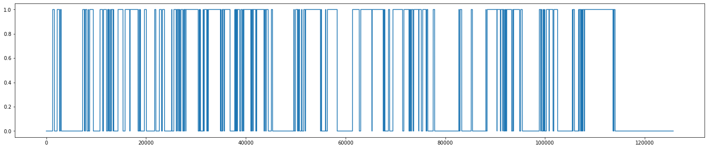
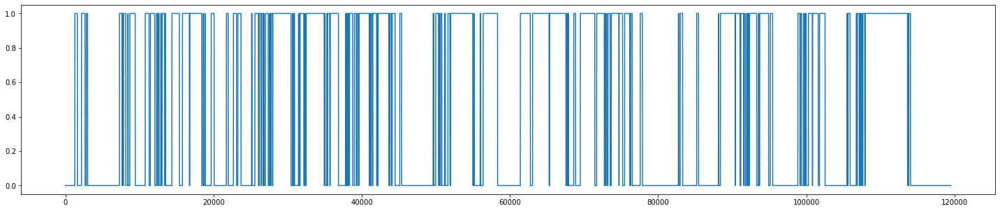

# Importing and Exporting Movie Labels

This file walks you through the pipeline of extracting the start and stop times of labels, which indicate at which time points in the movie a label has its onset and where it ends again. 

The time points are in play time (PTS), which represents the movie time.

The data then has to be stored in a certain folder (with a certain naming) so the database can directly read in the data and the table can be filled automatically.


```python
import json
import numpy as np
import matplotlib.pyplot as plt

from database.db_setup import *

import annotation.stimulus_driven_annotation.movies.processing_labels as processing_labels
import preprocessing.data_preprocessing.create_vectors_from_time_points as create_vectors_from_time_points
import database.config as config
```

## Set parameters


```python
path_to_json_file = "/home/tamara/Documents/PhD/advene"
name_json_file = "500days_of_summer_abspann_vorspann.json"
label_name = "summer"

path_save_file = "/home/tamara/Documents/PhD/DeepHumanVision_deploy/movie_annotation/useful_data/start_end_times/"
name_save_file = "start_stop_times_complete_{}_20200420.npy".format(label_name)
```

## Extract start stop times from json file


```python
values, start_times, stop_times = processing_labels.start_stop_values_from_json("{}/{}".format(path_to_json_file, name_json_file), label_name)
```


```python
label = processing_labels.make_label_from_start_stop_times(values, start_times, stop_times, config.PTS_MOVIE_new)
```


```python
values_complete, starts_complete, stops_complete = create_vectors_from_time_points.get_start_stop_times_from_label(config.PTS_MOVIE_new, label)
```

## Save start and stop times

The start and stop times need to be stored in the corresponding folder, form where the data base reads in the files

The naming of the files has to be of the certain format:

labelID_labelName_annotatorDI_annotationDate_category.npy


```python
# np.save("{}{}".format(path_save_file, name_save_file), np.array([values_complete, starts_complete, stops_complete]))
```

## Check label created from start stop times 


```python
label2 = processing_labels.make_label_from_start_stop_times(values_complete, starts_complete, stops_complete, config.PTS_MOVIE_new)
plt.figure(figsize=(25,5))
plt.plot(label2)
```


    [<matplotlib.lines.Line2D at 0x7fd18ab520b8>]


    

    


### Fill table with MovieAnnotations in database


```python
#MovieAnnotation.populate()
```


```python
MovieAnnotation()
```


        <style type="text/css">
            .Relation{
                border-collapse:collapse;
            }
            .Relation th{
                background: #A0A0A0; color: #ffffff; padding:4px; border:#f0e0e0 1px solid;
                font-weight: normal; font-family: monospace; font-size: 100%;
            }
            .Relation td{
                padding:4px; border:#f0e0e0 1px solid; font-size:100%;
            }
            .Relation tr:nth-child(odd){
                background: #ffffff;
            }
            .Relation tr:nth-child(even){
                background: #f3f1ff;
            }
            /* Tooltip container */
            .djtooltip {
            }
            /* Tooltip text */
            .djtooltip .djtooltiptext {
                visibility: hidden;
                width: 120px;
                background-color: black;
                color: #fff;
                text-align: center;
                padding: 5px 0;
                border-radius: 6px;
                /* Position the tooltip text - see examples below! */
                position: absolute;
                z-index: 1;
            }
            #primary {
                font-weight: bold;
                color: black;
            }

            #nonprimary {
                font-weight: normal;
                color: white;
            }

            /* Show the tooltip text when you mouse over the tooltip container */
            .djtooltip:hover .djtooltiptext {
                visibility: visible;
            }
        </style>

        <b>information about video annotations (e.g. labels of characters);</b>
            <div style="max-height:1000px;max-width:1500px;overflow:auto;">
            <table border="1" class="Relation">
                <thead> <tr style="text-align: right;"> <th> <div class="djtooltip">
                                <p id="primary">annotator_id</p>
                                <span class="djtooltiptext">unique ID for each annotator</span>
                            </div></th><th><div class="djtooltip">
                                <p id="primary">label_name</p>
                                <span class="djtooltiptext">label name</span>
                            </div></th><th><div class="djtooltip">
                                <p id="primary">annotation_date</p>
                                <span class="djtooltiptext">date of annotation</span>
                            </div></th><th><div class="djtooltip">
                                <p id="nonprimary">values</p>
                                <span class="djtooltiptext">list of values that represent label</span>
                            </div></th><th><div class="djtooltip">
                                <p id="nonprimary">start_times</p>
                                <span class="djtooltiptext">list of start times of label segments in movie play time (PTS)</span>
                            </div></th><th><div class="djtooltip">
                                <p id="nonprimary">stop_times</p>
                                <span class="djtooltiptext">list of stop times of label segments in movie play time (PTS)</span>
                            </div></th><th><div class="djtooltip">
                                <p id="nonprimary">category</p>
                                <span class="djtooltiptext">categoy of label; e.g. 'character', 'emotion', 'location'</span>
                            </div></th><th><div class="djtooltip">
                                <p id="nonprimary">indicator_function</p>
                                <span class="djtooltiptext">full indicator function, one value for each movie frame</span>
                            </div></th><th><div class="djtooltip">
                                <p id="nonprimary">additional_information</p>
                                <span class="djtooltiptext">space for additional information</span>
                            </div> </th> </tr> </thead>
                <tbody> <tr> <td>p1</td>
<td>paul</td>
<td>2020-04-20</td>
<td>=BLOB=</td>
<td>=BLOB=</td>
<td>=BLOB=</td>
<td>character</td>
<td>=BLOB=</td>
<td></td></tr><tr><td>p1</td>
<td>rachel</td>
<td>2020-04-20</td>
<td>=BLOB=</td>
<td>=BLOB=</td>
<td>=BLOB=</td>
<td>character</td>
<td>=BLOB=</td>
<td></td></tr><tr><td>p1</td>
<td>tom</td>
<td>2020-04-20</td>
<td>=BLOB=</td>
<td>=BLOB=</td>
<td>=BLOB=</td>
<td>character</td>
<td>=BLOB=</td>
<td></td></tr><tr><td>p2</td>
<td>mckenzie</td>
<td>2020-04-20</td>
<td>=BLOB=</td>
<td>=BLOB=</td>
<td>=BLOB=</td>
<td>character</td>
<td>=BLOB=</td>
<td></td></tr><tr><td>p2</td>
<td>summer</td>
<td>2020-04-20</td>
<td>=BLOB=</td>
<td>=BLOB=</td>
<td>=BLOB=</td>
<td>character</td>
<td>=BLOB=</td>
<td></td> </tr> </tbody>
            </table>

            <p>Total: 5</p></div>


## Patient Aligned Labels

The patient aligned labels are labels aligned to the watch log of the patient, since patients skipped through the movie. They depend on the default labels. The table PatientAlignedMovieAnnotation can therefore be filled automatically. 

To refill patient aligned labels table: uncomment and execute the next line


```python
#PatientAlignedMovieAnnotation.populate()
```


```python
PatientAlignedMovieAnnotation()
```


        <style type="text/css">
            .Relation{
                border-collapse:collapse;
            }
            .Relation th{
                background: #A0A0A0; color: #ffffff; padding:4px; border:#f0e0e0 1px solid;
                font-weight: normal; font-family: monospace; font-size: 100%;
            }
            .Relation td{
                padding:4px; border:#f0e0e0 1px solid; font-size:100%;
            }
            .Relation tr:nth-child(odd){
                background: #ffffff;
            }
            .Relation tr:nth-child(even){
                background: #f3f1ff;
            }
            /* Tooltip container */
            .djtooltip {
            }
            /* Tooltip text */
            .djtooltip .djtooltiptext {
                visibility: hidden;
                width: 120px;
                background-color: black;
                color: #fff;
                text-align: center;
                padding: 5px 0;
                border-radius: 6px;
                /* Position the tooltip text - see examples below! */
                position: absolute;
                z-index: 1;
            }
            #primary {
                font-weight: bold;
                color: black;
            }

            #nonprimary {
                font-weight: normal;
                color: white;
            }

            /* Show the tooltip text when you mouse over the tooltip container */
            .djtooltip:hover .djtooltiptext {
                visibility: visible;
            }
        </style>

        <b>Movie Annotations aligned to patient time / time points are in neural recording time</b>
            <div style="max-height:1000px;max-width:1500px;overflow:auto;">
            <table border="1" class="Relation">
                <thead> <tr style="text-align: right;"> <th> <div class="djtooltip">
                                <p id="primary">annotator_id</p>
                                <span class="djtooltiptext">unique ID for each annotator</span>
                            </div></th><th><div class="djtooltip">
                                <p id="primary">label_name</p>
                                <span class="djtooltiptext">label name</span>
                            </div></th><th><div class="djtooltip">
                                <p id="primary">annotation_date</p>
                                <span class="djtooltiptext">date of annotation</span>
                            </div></th><th><div class="djtooltip">
                                <p id="primary">session_nr</p>
                                <span class="djtooltiptext">session ID</span>
                            </div></th><th><div class="djtooltip">
                                <p id="primary">patient_id</p>
                                <span class="djtooltiptext">patient ID</span>
                            </div></th><th><div class="djtooltip">
                                <p id="nonprimary">label_in_patient_time</p>
                                <span class="djtooltiptext">label matched to patient time (pts)</span>
                            </div></th><th><div class="djtooltip">
                                <p id="nonprimary">values</p>
                                <span class="djtooltiptext">list of values that represent label</span>
                            </div></th><th><div class="djtooltip">
                                <p id="nonprimary">start_times</p>
                                <span class="djtooltiptext">list of start times of label segments in neural recording time</span>
                            </div></th><th><div class="djtooltip">
                                <p id="nonprimary">stop_times</p>
                                <span class="djtooltiptext">list of stop times of label segments in neural recording time</span>
                            </div></th><th><div class="djtooltip">
                                <p id="nonprimary">additionl_information</p>
                                <span class="djtooltiptext"></span>
                            </div> </th> </tr> </thead>
                <tbody> <tr> <td>p1</td>
<td>paul</td>
<td>2020-04-20</td>
<td>1</td>
<td>60</td>
<td>=BLOB=</td>
<td>=BLOB=</td>
<td>=BLOB=</td>
<td>=BLOB=</td>
<td></td></tr><tr><td>p1</td>
<td>rachel</td>
<td>2020-04-20</td>
<td>1</td>
<td>60</td>
<td>=BLOB=</td>
<td>=BLOB=</td>
<td>=BLOB=</td>
<td>=BLOB=</td>
<td></td></tr><tr><td>p1</td>
<td>tom</td>
<td>2020-04-20</td>
<td>1</td>
<td>60</td>
<td>=BLOB=</td>
<td>=BLOB=</td>
<td>=BLOB=</td>
<td>=BLOB=</td>
<td></td></tr><tr><td>p2</td>
<td>mckenzie</td>
<td>2020-04-20</td>
<td>1</td>
<td>60</td>
<td>=BLOB=</td>
<td>=BLOB=</td>
<td>=BLOB=</td>
<td>=BLOB=</td>
<td></td></tr><tr><td>p2</td>
<td>summer</td>
<td>2020-04-20</td>
<td>1</td>
<td>60</td>
<td>=BLOB=</td>
<td>=BLOB=</td>
<td>=BLOB=</td>
<td>=BLOB=</td>
<td></td> </tr> </tbody>
            </table>

            <p>Total: 5</p></div>


As an example, here we show how to extract a patient aligned label from the database


```python
summer_60 = (PatientAlignedMovieAnnotation() & "patient_id=60" & "label_name='summer'").fetch("label_in_patient_time")[0]
values, start, stop = (PatientAlignedMovieAnnotation() & "patient_id=60" & "label_name='summer'").fetch("values", "start_times", "stop_times")
```


```python
plt.figure(figsize=(25,5))
plt.plot(summer_60)
```


    [<matplotlib.lines.Line2D at 0x7fd18ac4cba8>]


    

    


```python

```
