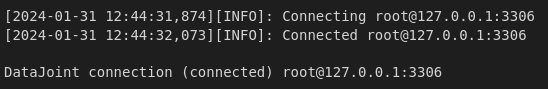

# Configure and connect to a database

### **Goal:**

Configure the database settings in `epiphyte`, initiate and connect to the database

### **Requirements:** 

* completion of the previous tutorials

### **Steps:**

1. Configure access info
2. Configure storage
3. Check the database connection


-----------

## 1. Configure access info

The connection to the database is configured in the file, `/src/epiphyte/database/access_info.py`.

`access_info.py` contains the following snippet:


```python
import os
import datajoint as dj

dj.config['enable_python_native_blobs'] = True
dj.config['database.host'] = '127.0.0.1:3306'            # Option A
dj.config['database.user'] = 'root'                      # Option B
dj.config['database.password'] = 'simple'                # Option B

if not 'stores' in dj.config:
    dj.config['stores'] = {}

epi_schema = dj.schema('epiphyte_mock')

dj.conn()
```

Before running this code, you will need to change the parameters appropriately.

### **Option A:** `database.host`

#### Local database (PC or workstation)?

➡️ Keep option A as is, `127.0.0.1:3306`.

#### VM-hosted database (PC or workstation)?

➡️ If you are hosting the database via a virtual machine (VM), set `database.host` (IP address of the computer hosting the database) to that of your remote machine's. You can find your remote machine's IP by running the following command on that machine's terminal:

<pre style="background-color: #1E1E1E; color: white; padding: 10px; border-radius: 5px; border-left: 5px solid #007bff;">
hostname -I
</pre>

In case you receive multiple outputs, take the first entry. 

### **Option B:** `database.user` and `database.password`

#### Testing infrastructure?

➡️ Keep the username and password as is. 

#### Real data and/or multiple users?

➡️ If using real data, then you will need to change the `root` user password directly in MySQL, and can specify it here (Warning: this is stored in plain text. Safest option is to leave this line out, and enter the password for each separate database connection.)

➡️ If there are multiple users, each user will modify this line to accommodate their own username and password. 

## 2. Configure storage

If you're working locally or without using the optional large-storage backend, run the following cell to configure storage:


```python
dj.config['stores'] = {
    'local': {  # store in files
        'protocol': 'file',
        'location': os.path.abspath('./dj-store')
    }}
```

If you're working with a remote server using MinIO, run the cell below to configure storage. Replace the IP address (Option C) with the same one as above (Option A, i.e., the IP for your remote server running the VM). You'll also need to change the bucket name (Option D) to the one you're using:


```python
dj.config["stores"]["minio"] = {  
        "protocol": "s3",
        "endpoint": "127.0.0.1:9000",  # Option C
        "bucket": "<bucket>",          # Option D
        "location": "data",
        "access_key": "root", 
        "secret_key": "simple" 
    }
```

Successful connection will output something like:



This code is already saved in the file `/src/epiphyte/database/access_info.py`, and can be modified to change the connection parameters. 

Once configured, you can connect by importing the `access_info.py` directly, instead of running the snippet above: 


```python
# set relative import
from .database import access_info 
```

## 3. Check the database connection

The following code creates an `ERD` diagram, also known as an Entity Relationship Diagram. 

This diagram visualizes the relationships between database tables. It should be empty at the moment, since no tables have been defined for the database. These will be defined and created in the next step. 


```python
erd = dj.ERD(epi_schema)
erd
```

After creating tables, establishing relationships, and defining inheritances between them, you can visualize these entities and their connections using the function `dj.ERD(<schema_name>)`.

Continue to *[Design and implement a database](<5. Design and implement a database.md>)*.
